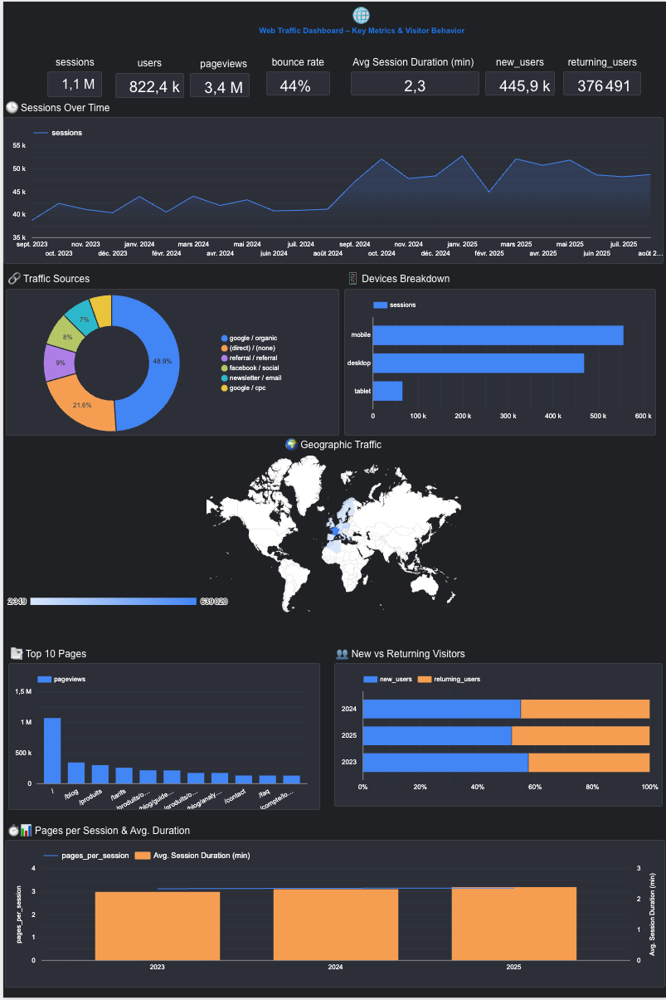

# 📊 Web Traffic Dashboard

Web traffic analytics dashboard built with Google Looker Studio.

## 📈 Key Metrics

- **Sessions**
- **Users**
- **Page Views**
- **Bounce Rate**
- **Average Duration**
- **New Users**
- **Returning Users**

## 🔧 Features

- Sessions evolution over time
- Traffic sources breakdown (Google Organic 48.9%, Direct 21.6%)
- Device breakdown (Mobile, Desktop, Tablet)
- Geographic traffic map
- Top 10 pages analysis
- New vs returning visitors comparison

## 🛠️ Technologies

- Google Looker Studio
- Google Analytics
- Interactive visualizations
- Automatic updates

## 🔗 Live Dashboard

[View live dashboard](https://lookerstudio.google.com/reporting/ad312fdd-a568-4a2d-9cdb-f6841c855c19)

## 🚀 Usage

1. Connect Google Analytics
2. Import Looker Studio template
3. Configure filters
4. Share dashboard
